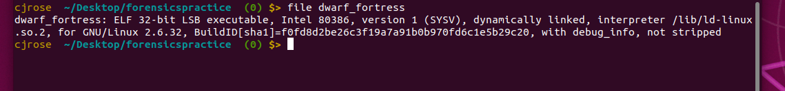
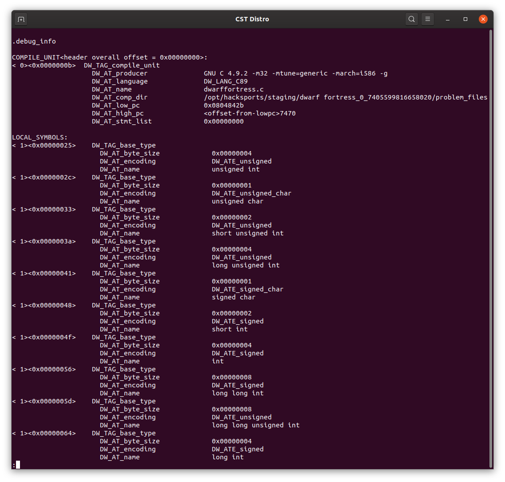
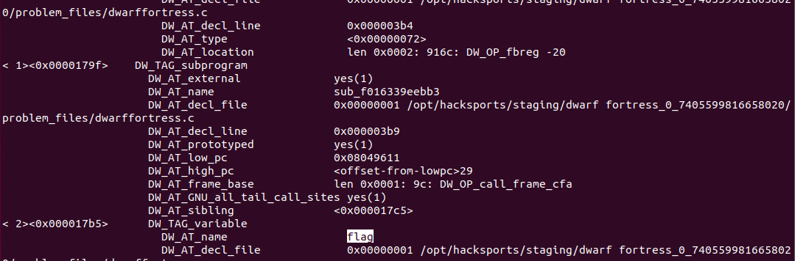

# Dwarf Fortress
The challenge gives us an executable(linked above) and asks us to find the function name for a varibale named flag.
 
*Tell me, Urist: what is the name of the function in this binary which used to contain a variable named flag?*

---
If we `file dwarf_fortress`, it gives us this output:

 
With further reading we see that elf is a linking and compiling format used back in the day. The hint given is how can we read the DWARF debugging inforamtion. There just so happens to be a handy  tool called dwarfdump that will give us the debugged information from elf compiled programs.
 

What is the info we want to see? How do we do this?
So if we `dwarfdump dwarf_fortress | less` we get this:

 
If we search for flag we are given this output. How do we read this what does it mean?:

 
So if you don't know the formatting goes in level the first level is the function info and subsequent levels describe variables. So you can then easily find the name of the function which is: **sub_f016339eebb3**
